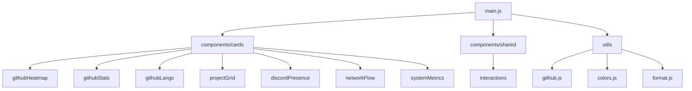

##  xbl1e
My website — Vite + GSAP + Lenis + Three.js.

### &nbsp;&nbsp;Structure



```
src/
├── main.js                 # Entry point
├── components/
│   ├── cards/
│   │   ├── discordPresence.js   # Discord rich presence (Lanyard API)
│   │   ├── githubHeatmap.js     # Three.js contribution globe
│   │   ├── githubLangs.js       # Language donut chart
│   │   ├── githubStats.js       # Monthly stats line chart
│   │   ├── networkFlow.js        # Animated network canvas
│   │   ├── projectGrid.js       # GitHub repos renderer
│   │   └── systemMetrics.js      # Sparkline canvas
│   └── shared/
│       └── interactions.js       # GSAP: scramble, reveal, magnetic
├── styles/
│   └── main.css                 # CSS custom properties
└── utils/
    ├── colors.js                # PALETTE (accent, github levels, discord)
    ├── format.js                # Duration formatting
    └── github.js                # GitHub GraphQL/REST + caching
```
### &nbsp;&nbsp;Usage

```bash
npm install      # install dependencies
npm run dev      # dev server
npm run build    # production build
npm run preview  # preview build
```

> [!NOTE]
> Optional: set `VITE_GITHUB_TOKEN` on `.env` for higher GitHub API rate limits. Without it, the site falls back to mock/limited data.